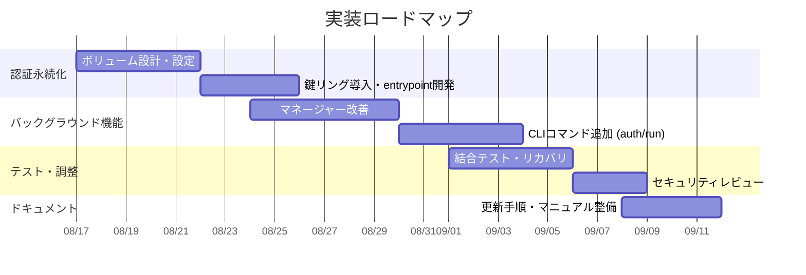

```markdown
# 概要（Executive Summary）

Antigravity CLI（`agy`）は現状、ヘッドレス環境で認証トークンを永続化できず、再起動やターミナル切断のたびに再ログインを強いられる問題があります。また、`agyCLI-multicoding` の各エージェントコンテナ（Developer/Tester/Reviewer/Security/Researcher）に独立したアカウントでログインし、それぞれの認証情報を保持しつつバックグラウンド実行できるようにする必要があります。そこで本計画では、**「1エージェント = 1コンテナ = 1アカウント = 1永続認証セッション」** となる設計を提案します。具体的には以下の変更を行います。

- **Docker Volume** を用いて各コンテナ内の `~/.gemini/antigravity-cli` ディレクトリ（認証情報置き場）をホスト上に永続化。コンテナ再起動・再作成後もログイン状態を維持する。
- **GNOME Keyring＋DBus** を各コンテナに導入し、`agy` CLI が要求するOSシークレットサービスを実行する。これにより `agy` が鍵を永続保存できるようにする。
- **バックグラウンド実行** の実現法を検討し、tmux 依存ではなく、Managerプロセスやデーモン化によって `agy` セッションをデタッチ可能にする。
- **ホスト側 CLI の拡張**：ユーザーが `agy auth login <エージェント名>` や `agy run <エージェント名> "タスク"` コマンドだけで各エージェントコンテナ内で操作できるようにする。`docker exec` を直接使わずに通信できる仕組みを追加。

これにより、ターミナルを閉じても AI エージェントは動作を継続し、後から `agy task list` や `agy attach` で進捗・結果を確認できる運用が可能となります（下図）。


```mermaid
graph LR
  U[ユーザー（agy CLI）] --> M[マネージャー・デーモン]
  M --> Dev[Developer エージェント\n(Antigravity CLI)]
  M --> Tes[Tester エージェント\n(Antigravity CLI)]
  M --> Rev[Reviewer エージェント\n(Antigravity CLI)]
  M --> Sec[Security エージェント\n(Antigravity CLI)]
  M --> Res[Researcher エージェント\n(Antigravity CLI)]
  Dev --> V1[Volume: agy-dev-auth]
  Tes --> V2[Volume: agy-tester-auth]
  Rev --> V3[Volume: agy-reviewer-auth]
  Sec --> V4[Volume: agy-security-auth]
  Res --> V5[Volume: agy-research-auth]
```


## 変更点／追加項目

### 1. Docker Compose とコンテナ設定の変更

- **Named Volume の定義**: `docker-compose.yml` に各エージェント用のボリュームを追加します。例えば Developer 用に以下のように設定します（他のエージェントも同様）。
  ```yaml
  services:
    developer:
      volumes:
        - agy-dev-auth:/home/agy/.gemini/antigravity-cli
  volumes:
    agy-dev-auth:
    agy-tester-auth:
    agy-reviewer-auth:
    agy-security-auth:
    agy-research-auth:
  ```
  これにより、コンテナ内 `/home/agy/.gemini/antigravity-cli` (認証トークン保存ディレクトリ) がホスト上 `agy-dev-auth` ボリュームに永続化されます。コンテナ削除・再作成後も同じボリュームをマウントすればログイン状態が維持できます。

- **GNOME Keyring と DBus のインストール**: 各コンテナの `Dockerfile` に以下を追加し、`agy` CLI が要求するシークレットサービスを提供します。
  ```dockerfile
  RUN apt-get update && apt-get install -y \
        dbus-x11 libsecret-1-0 gnome-keyring
  ```
  さらにエントリポイントスクリプト（例: `entrypoint.sh`）で DBus と鍵リングを起動します。例:
  ```bash
  #!/bin/bash
  # DBus セッションを開始し、鍵リングをアンロックする
  eval "$(dbus-launch --sh-syntax)"
  echo | gnome-keyring-daemon --unlock
  gnome-keyring-daemon --start --components=secrets,pkcs11,ssh
  export SSH_AUTH_SOCK
  # 続いて Manager/Worker プロセスを起動
  exec "$@"
  ```
  WSL ユーザによる報告によれば、ヘッドレス環境では鍵リングが存在しないとトークンを保持できないため、gnome-keyring を導入することで問題が解決するケースがあります。さらに鍵リングを空パスワードでアンロックすることで、GUIログインが無い環境でもロックされないようにしています。

- **認証情報の隔離**: 上記で示したように各コンテナに専用ボリュームを割り当て、コンテナごとに個別アカウントの認証情報を完全に分離します。ホスト上では `~/.config/agy/auth/developer` など任意のディレクトリにボリュームをマッピングし、コンテナ側の `~/.gemini/antigravity-cli` に接続します。

### 2. `agy` CLI コマンドの拡張／変更

- **`agy auth login <エージェント>`**: これまで Docker exec で対話的にログインしていた部分を、ホスト CLI から直接操作可能にします。ホストで下記を実行すると、
  ```bash
  $ agy auth login agent-a
  ```
  例: 
  ```
  Agent: agent-a
  コンテナ: developer
  認証を開始しています...
  ブラウザで以下のURLを開き、ログインを完了してください:
  https://accounts.google.com/o/oauth2/v2/auth?...
  認証コードを入力してください: [ユーザーがコードを入力]
  ✓ 認証成功: agent-a のセッションを保存しました。
  ```
  のように表示させ、完了後は CLI がバックグラウンドで終了します。内部ではマネージャーが対象コンテナ内で `agy login` を実行し、DBusキーリング経由でトークンを保存しています。以降、ターミナルを閉じても認証状態が保持されます。

- **`agy run --detach`**: 従来の `agy run` を拡張し `--detach` オプションを導入。`agy run agent-a "タスク内容"` をバックグラウンドで実行し、すぐプロンプトに戻せます。例:
  ```bash
  $ agy run --detach agent-a "このプロジェクトを完成させてください"
  新規タスク作成: task-01H...
  Agent: agent-a (Developer) → RUNNING
  （Ctrl+Cやターミナル切断可能）
  ```
  ターミナルを閉じてもタスクは継続実行されます。後で `agy task list` や `agy task status task-01H...` で進捗確認できます。

- **`agy attach <タスクID>` / `agy logs <タスクID>`**: バックグラウンドで動作中のタスクに再接続し、ログをリアルタイムに表示可能にします。例:
  ```bash
  $ agy attach task-01H...
  Task: task-01H...
  Status: RUNNING
  Developer   ████████░░░░  60%  (例: コード実装中)
  Tester      ░░░░░░░░░░  0%
  ...
  ```
  このときも `agy` CLI はマネージャー経由で通信しており、`docker exec` を使わなくても進行状況を取得できます。

- **ログ確認と停止／再開**: `agy task list`、`agy task status`、`agy task stop`、`agy task resume` などを追加し、タスク管理を行います。これらはマネージャーを介して各エージェントに制御命令を送信し、トークン漏洩や実体証明が不要な構成とします。

### 3. 認証方式の代替案（オプション）

無人環境では、**Gemini APIキー**を使う方法もあります。Antigravity CLI は `~/.gemini/antigravity-cli/settings.json` で `modelProvider: gemini` を設定し、環境変数 `GEMINI_API_KEY` を指定すると、Google アカウントログインをスキップしてAPIキー認証に切り替えられます。ヘッドレスやCI環境ではこちらの方がシンプルな場合があります。ただし今回の要求「Agentごとにアカウントログイン」が前提であれば、従来どおり OAuth 認証を使います。

### 4. バックグラウンド実行方式の比較

下表は、いくつかの方法を比較したものです。最終的には**Managerデーモン or Supervisor的プロセス**を用いるアプローチを推奨します。

| 方法        | 概要                                    | メリット                                     | デメリット                                  |
|------------|----------------------------------------|--------------------------------------------|-------------------------------------------|
| `tmux`/`screen` | 各エージェントコンテナ内で tmux セッションを立て、`agy` CLI を実行 | - 簡易で既存環境で動作可能<br>- ログ確認もtmux再接続で容易 | - 依存性（tmuxインストール）<br>- 自動復旧なし<br>- プログラム的制御は困難 |
| Systemd ユーザーサービス | コンテナ内でsystemdのユーザーインスタンスを使い、`agy`起動 | - 再起動・自動再起動機能あり<br>- ログもjournaldで管理可能 | - Systemd非対応OSも多い<br>- 設定が煩雑          |
| Supervisor/forever   | supervisor等で`agy`をバックグラウンド起動 | - デーモン制御が可能<br>- 再起動監視やログ管理が容易   | - 追加ソフトの導入<br>- コンテナ設計が複雑に    |
| **Managerデーモン**    | 1つの常駐マネージャープロセスがタスクを発行・監視  | - 独自のフェイルオーバー・再起動ロジックを組み込み可能<br>- ユーザCLIとの連携が柔軟 | - 実装コストは高い<br>- 新機能追加時に負荷増大可能 |

**推奨**: 最終設計では「マネージャー・デーモン方式」とし、エージェントコンテナへの起動命令とログ収集を一元化します。これにより tmux や systemd に依存せず、再起動や異常復旧もマネージャー側で検知・実行できます。

### 5. セキュリティ考慮

- **認証情報の露出防止**: 
  - 生成されたOAuthトークンやAPIキーは**DockerイメージやGitに決して含めない**。環境変数やボリューム経由で安全に管理します。  
  - ログ出力時には、`DOG_ADRIFT_KEY=****` のようにマスキングし、`~/.gemini/antigravity-cli/antigravity-oauth-token` 等のファイルもGit追跡から除外します。  
- **ネットワーク認証**: マネージャーAPIにTLSやAPIトークンを設定し、ホスト→コンテナ間通信を認証付きにします。  
- **パーミッション管理**: 各エージェントコンテナは原則 `read-only` 権限のものは `nginx` など別ユーザ、書込権限が必要なものは `agy` ユーザで実行するなど、権限分割を徹底します。

### 6. テスト・リカバリ手順

- **永続化テスト**: `agy auth login agent-a` → ターミナル再起動 → `agy run agent-a ...` で自動再ログインせず継続することを確認。  
- **ターミナル切断テスト**: `agy run agent-a ... --detach` 後にホストを再ログインし、`agy task status` でステータスが見えるか検証。  
- **コンテナ再起動テスト**: `docker compose restart developer`（開発Agent）後も `agy task status` が継続可能であることを確認。  
- **障害復旧**: エージェントコンテナを強制終了後もマネージャーが自動再起動し、タスクを再開する。  
- **ログの整合性**: `agy logs <task-id>` で必要な情報が欠けず表示されることをチェック。  
- **セキュリティテスト**: 秘匿情報が出力されていないか（例：トークンマスキング）を確認。コンテナ内の鍵リングファイルが漏れないように調べる。

### 7. 移行ステップ

1. **Docker Compose 更新**: 既存の `docker-compose.yml` に認証ボリュームと環境変数（必要なら`SSH_CONNECTION`設定）を追加し、`restart: unless-stopped` を確認。  
2. **Dockerfile 更新**: 各エージェント用イメージに `gnome-keyring` などインストールし、entrypointで鍵リング起動を組み込む。  
3. **CLI 変更**: `cli.py` 等に `auth login`, `run --detach`, `attach` コマンドを追加。必要に応じて Manager/Worker API (HTTPやRPC) も実装。  
4. **初回ログイン**: ホストで `agy auth login agent-a` を実行し、ブラウザ連携で各エージェントの認証を完了させる。これで各ボリュームにトークンが保存される。  
5. **検証**: 以上のテストケースを順番に実施し、要件を満たすことを確認する。

## 実装スケジュール（目安）



## 参考文献

- Docker公式：コンテナの永続ストレージに**Volume**を使用することが推奨されています。  
- Antigravity CLI公式ドキュメント：Gemini APIキーを使うとヘッドレス環境でもサインイン不要になります。  
- Google開発者フォーラム：WSLなどヘッドレス環境でトークン保持に**OSキーリングが必要**である旨の報告。  
- Antigravity CLI GitHub Issue：現在のCLIはヘッドレス環境でトークンを保持せず再ログインを強いる不具合が確認されています。  

```  

